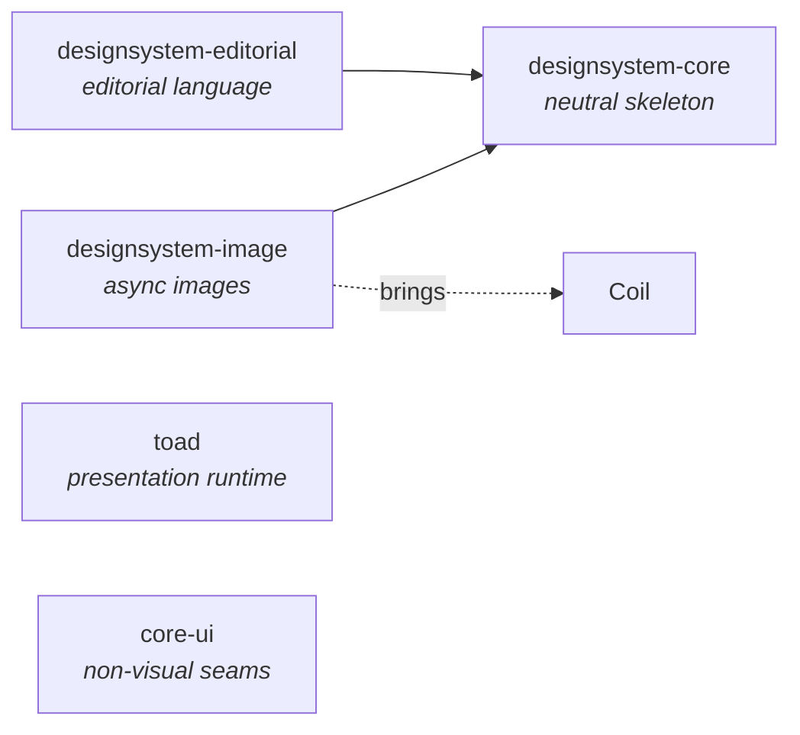

<div align="center">

# rhaydus-foundation

**A shared backbone for Kotlin Multiplatform apps — published libraries, build tooling, conventions, and the Claude Code assets that teach an AI assistant how to use them.**


</div>

---

## Why this exists

Ship more than one Kotlin Multiplatform app on the same stack and the shared parts quietly drift — the same TOAD presentation runtime, the same Compose design language, the same ktlint rules and Gradle conventions, duplicated and slowly diverging. `rhaydus-foundation` is the single, **versioned** home for everything they share, so a fix or an improvement lands once and every consuming app inherits it.

It ships three things most "shared module" repos don't bother to keep together:

- 📦 **Published KMP libraries** — drop-in via Maven Central, opt-in by concern.
- 🧰 **Build + style tooling** — Gradle convention plugins, a shared version catalog, and a custom ktlint ruleset.
- 🤖 **Claude Code assets** — a plugin of specialist agents, a skill, and a docs index, so an AI assistant working in a consuming app *knows what's available and is steered to actually use it*.

---

## What's inside

### Published libraries (`nl.rhaydus:*`, version `0.2.0`)

| Module | Coordinate | What it gives you |
|---|---|---|
| **TOAD runtime** | `nl.rhaydus:toad` | The home-grown MVI-style presentation framework: `ToadScreenModel`, `UiState`/`UiAction`/`UiEvent`, `Collector`, `ActionScope`. |
| **Core UI seams** | `nl.rhaydus:core-ui` | Non-visual seams: `AppDispatchers`, date/time/number formatting. |
| **Design system — core** | `nl.rhaydus:designsystem-core` | The **design-agnostic** Compose skeleton: theme scaffold, layout primitives (window-size classes, two-pane, content-width caps), modifiers, motion + reduced-motion seam, haptics, the button family. |
| **Design system — editorial** | `nl.rhaydus:designsystem-editorial` | **Opt-in** editorial design language: shared type-role contract + components (section header, hero stat, drop cap, search field, pull-to-refresh eyebrow). |
| **Design system — image** | `nl.rhaydus:designsystem-image` | **Opt-in** async images on Coil: plain, placeholder, and shimmer variants. |
| **Version catalog** | `nl.rhaydus:catalog` | The shared third-party version set, consumable as a Gradle version catalog. |
| **ktlint rules** | `nl.rhaydus:ktlint-rules` | 10 custom layout rules (one-per-line arg wrapping, trailing commas, blank-line rules, sibling-composable spacing, and more) with auto-fix. |

### Tooling

- **Gradle convention plugins** (`build-logic/`): `rhaydus.android.library`, `rhaydus.kmp.library`, `rhaydus.android.compose`, `rhaydus.kmp.compose` — uniform module setup (SDK/JDK levels, the Android+iOS `mobileMain` seam, the test stack, Compose).
- **Canonical conventions docs** (`docs/`): see [`CAPABILITIES.md`](docs/CAPABILITIES.md) (the index of everything available), plus architecture, TOAD, code-style, and design-system foundations.

### Module graph



An app that wants a different look depends on `designsystem-core` alone and never pulls the editorial language or Coil — the opinionated layers are opt-in by design.

---

## Quick start

### 1. Add a library

```kotlin
// build.gradle.kts
dependencies {
    implementation("nl.rhaydus:toad:0.2.0")
    implementation("nl.rhaydus:designsystem-core:0.2.0")
    implementation("nl.rhaydus:designsystem-editorial:0.2.0") // opt-in
    implementation("nl.rhaydus:designsystem-image:0.2.0")     // opt-in (pulls Coil)
}
```

Artifacts publish to **Maven Central** under the `nl.rhaydus` group (verified by DNS, no server) — consumers need **no credentials**, just `mavenCentral()`.

<details>
<summary><b>Optional: consume the shared version catalog</b></summary>

```kotlin
// settings.gradle.kts
dependencyResolutionManagement {
    versionCatalogs {
        create("rhaydus") { from("nl.rhaydus:catalog:0.2.0") }
    }
}
```
App-only libraries (Apollo, Room, etc.) stay in your app's own catalog.
</details>

### 2. Develop against the foundation source (inner loop)

While iterating on the foundation *and* an app together, skip the publish cycle entirely:

```properties
# <app>/local.properties
foundation.local=true
```

The app's `settings.gradle.kts` reads that flag and `includeBuild("../rhaydus-foundation")`; Gradle substitutes the published coordinates for local source automatically — no version bumps, instant cross-repo edits. Flip it back to return to the pinned release.

### 3. Install the Claude Code plugin

```
/plugin marketplace add CinqueIzumi/rhaydus-foundation
/plugin install rhaydus-kotlin@rhaydus
```

---

## 🤖 The Claude Code plugin

The `rhaydus-kotlin` plugin makes a consuming app's AI assistant fluent in the foundation. It ships:

| Agent / asset | Role |
|---|---|
| **`rhaydus-adopt`** | Onboards a project: wires the catalog, convention plugins, and `includeBuild`; writes a managed routing block into the app's `CLAUDE.md`; flags prerequisite migrations. |
| **`rhaydus-logic`** | Builds feature **logic** — the TOAD state/action contract, ScreenModel, use cases, data. |
| **`rhaydus-ui`** | Builds feature **UI** — the stateless Compose render, from the foundation design system **and** the app's own brand doc. |
| **`code-reviewer` / `unit-test-writer`** | Review and tests, tuned to the conventions. |
| **`style-check` skill** | Auto-fix mechanizable style, then run the project's gates. |
| **docs-first hook** | Nudges reading the docs (and [`CAPABILITIES.md`](docs/CAPABILITIES.md)) before exploring. |

Every agent reads [`CAPABILITIES.md`](docs/CAPABILITIES.md) first — so it reuses what already exists and stays correct for the exact version a project is pinned to, rather than working from a memorized snapshot.

---

## Versioning

One version covers the whole release: `foundation.version` in `gradle.properties` drives all seven published artifacts, and a `verifyPluginVersion` build gate **locks the Claude plugin's version to it** (the build fails if they drift). Bump them together; a tagged push (`v*`) publishes to Maven Central via CI.

---

## Build & release

```bash
./gradlew build                            # compile all targets (jvm/android/ios) + tests + gates
./gradlew publishToMavenLocal              # local smoke test of the real artifacts
./gradlew publishAndReleaseToMavenCentral  # release (normally done by CI on a v* tag)
```

Publishing credentials (Central Portal token + PGP key) are maintainer-only, supplied via env/Gradle properties and never committed — see `.github/workflows/publish.yml`.

---

## Stability

A `0.x` release: the public API may still change between minor versions before `1.0`, so pin a version when you depend on it. Every release builds on all targets (Android / iOS / Desktop) and is verified against a sample consumer before it ships.

## License

[MIT](LICENSE) © CinqueIzumi
